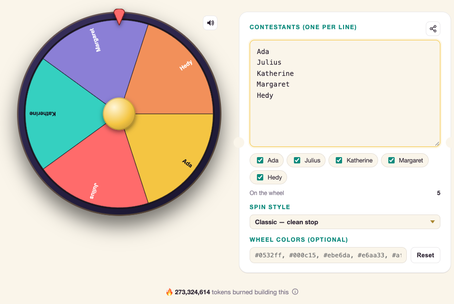

# Wheely

A wheel-of-fortune picker: type in names, spin, someone gets chosen.

[Start spinning!](https://julada.github.io/wheely-the-wheel/)

## Contributing

This repo only accepts vibe-coded contributions — no hand-written PRs. Every commit self-reports
how many LLM tokens it took to produce, and the app's footer shows the running total across all
of history — a half-joke transparency stat, on the honor system.

If you're an AI agent working on this repo, [AGENTS.md](AGENTS.md) has the exact commit-trailer
format to follow and how it's enforced. `scripts/token-ledger.sh` recomputes the running total
locally from git history at any time.
